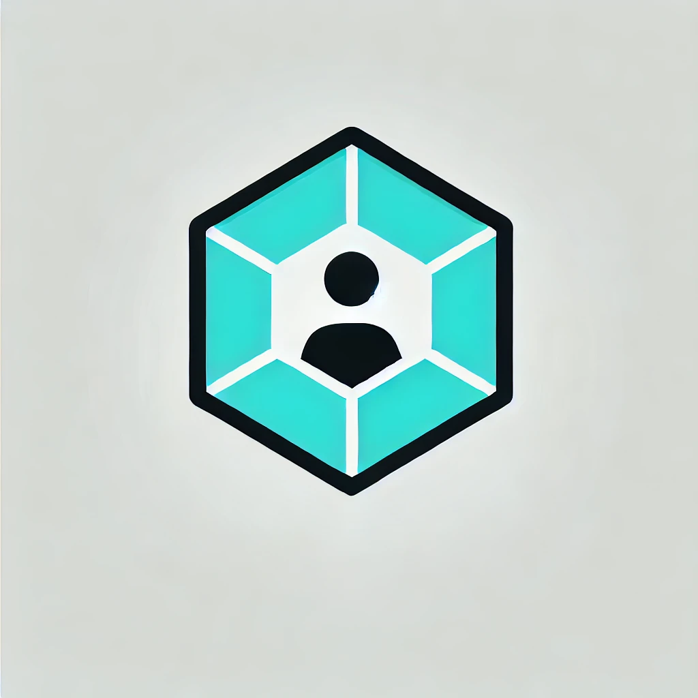

sub<a id="readme-top"></a>

<!-- PROJECT SHIELDS -->
<!--
*** I'm using markdown "reference style" links for readability.
*** Reference links are enclosed in brackets [ ] instead of parentheses ( ).
*** See the bottom of this document for the declaration of the reference variables
*** for contributors-url, forks-url, etc. This is an optional, concise syntax you may use.
*** https://www.markdownguide.org/basic-syntax/#reference-style-links
-->
[![Contributors][contributors-shield]][contributors-url]
[![Forks][forks-shield]][forks-url]
[![Stargazers][stars-shield]][stars-url]
[![Issues][issues-shield]][issues-url]
[![Unlicense License][license-shield]][license-url]
[![LinkedIn][linkedin-shield]][linkedin-url]


<!-- PROJECT LOGO -->
<br />
<div align="center">
  <a href="https://github.com/redwoudt/metis">
    
  </a>

  <h3 align="center">README for Design Patterns Made Practical — Build Your Own GenAI System</h3>

  <p align="center">
    An README to get your setup and learning Design Patterns
    <br />
    <a href="https://github.com/redwoudt/metis"><strong>Explore the docs »</strong></a>
    <br />
    <br />
    <a href="https://github.com/redwoudt/metis">View Demo (TODO) </a>
    &middot;
    <a href="https://github.com/redwoudt/metis/issues/new?labels=bug&template=bug-report---.md">Report Bug</a>
    &middot;
    <a href="https://github.com/redwoudt/metis/issues/new?labels=enhancement&template=feature-request---.md">Request Feature</a>
  </p>
</div>


<!-- TABLE OF CONTENTS -->
<details>
  <summary>Table of Contents</summary>
  <ol>
    <li>
      <a href="#about-the-project">About The Project</a>
      <ul>
        <li><a href="#built-with">Built With</a></li>
      </ul>
    </li>
    <li>
      <a href="#getting-started">Getting Started</a>
      <ul>
        <li><a href="#prerequisites">Prerequisites</a></li>
        <li><a href="#installation">Installation</a></li>
      </ul>
    </li>
    <li><a href="#usage">Usage</a></li>
    <li><a href="#roadmap">Roadmap</a></li>
    <li><a href="#contributing">Contributing</a></li>
    <li><a href="#license">License</a></li>
    <li><a href="#contact">Contact</a></li>
    <li><a href="#acknowledgments">Acknowledgments</a></li>
  </ol>
</details>


<!-- ABOUT THE PROJECT -->
## About The Project: Metis
[](https://codecov.io/gh/redwoudt/metis)

A modular orchestration system for generative AI, built using Python design patterns like Facade, Strategy, and Policy.

[![Product Name Screen Shot][product-screenshot]](https://example.com)

Design patterns are essential for building software systems that scale—but many developers never go beyond textbook examples. This git repo accommanpies the book (TODO: add link to amazon). The book flips the script by applying 23 essential design patterns inside a full-featured generative AI system. As you build, you’ll gain a deep understanding of how to architect real software—not just in theory, but in production.

Each chapter introduces one or more patterns in context—such as using Command and Chain of Responsibility to execute tools, or Builder and Template Method to construct complex prompts. You’ll explore memory and context using Memento, decouple APIs with 
Adapter and Bridge, and structure plugin architectures with Composite, Strategy, and Factory.

By the end, you’ll have implemented an architecture inspired by real GenAI platforms like ChatGPT and Gemini—while sharpening your architectural intuition. Whether you’re leading teams or leveling up your system design skills, this book is your blueprint for mastering patterns that matter.

What you will learn:
* Apply 23 software design patterns in real-world contexts
* Design modular systems with clear separation of concerns
* Build prompt, tool, and model pipelines with proven patterns
* Use Memento and State to manage sessions and context
* Integrate external APIs using Adapter and Bridge
* Add logging, metrics, and analytics with Observer and Visitor
* Apply Strategy and Decorator to customize responses
* Create a plugin system with extensibility in mind

The book teaches 23 software design patterns by applying each one to a practical component in a full-featured GenAI system. The modular architecture evolves with each chapter, helping readers understand how design decisions shape real-world AI systems.

<p align="right">(<a href="#readme-top">back to top</a>)</p>

### Built With

This section should list any major frameworks/libraries used to bootstrap your project. Leave any add-ons/plugins for the acknowledgements section. TODO

Here are a few examples.

* [![Next][Next.js]][Next-url]
* [![React][React.js]][React-url]
* [![Vue][Vue.js]][Vue-url]
* [![Angular][Angular.io]][Angular-url]
* [![Svelte][Svelte.dev]][Svelte-url]
* [![Laravel][Laravel.com]][Laravel-url]
* [![Bootstrap][Bootstrap.com]][Bootstrap-url]
* [![JQuery][JQuery.com]][JQuery-url]

<p align="right">(<a href="#readme-top">back to top</a>)</p>


<!-- GETTING STARTED -->
## Getting Started

TODO

### Prerequisites

TODO

This is an example of how to list things you need to use the software and how to install them.
* npm
  ```sh
  npm install npm@latest -g
  ```

### Installation

TODO

<p align="right">(<a href="#readme-top">back to top</a>)</p>


<!-- USAGE EXAMPLES -->
## Usage

### Run Request
The run_request.py script is now a CLI tool! You can run it from the terminal like this:

python examples/run_request.py --user user_123 --prompt "What’s the weather in London today?"

It will send the prompt through the RequestHandler and print the response.

### Check Test Coverage 

To check the current test coverage run: 

make coverage


<p align="right">(<a href="#readme-top">back to top</a>)</p>


<!-- ROADMAP -->
## Roadmap

TODO

See the [open issues](https://github.com/redwoudt/design-patterns-genai/issues) for a full list of proposed features (and known issues).

<p align="right">(<a href="#readme-top">back to top</a>)</p>


<!-- CONTRIBUTING -->
## Contributing

Contributions are what make the open source community such an amazing place to learn, inspire, and create. Any contributions you make are **greatly appreciated**.

If you have a suggestion that would make this better, please fork the repo and create a pull request. You can also simply open an issue with the tag "enhancement".
Don't forget to give the project a star! Thanks again!

1. Fork the Project
2. Create your Feature Branch (`git checkout -b feature/AmazingFeature`)
3. Commit your Changes (`git commit -m 'Add some AmazingFeature'`)
4. Push to the Branch (`git push origin feature/AmazingFeature`)
5. Open a Pull Request

### Top contributors:

<a href="https://github.com/redwoudt/metis/graphs/contributors">
  
</a>

<p align="right">(<a href="#readme-top">back to top</a>)</p>


<!-- LICENSE -->
## License

Creative Commons Attribution-NonCommercial 4.0 International License. See `LICENSE.txt` for more information.

<p align="right">(<a href="#readme-top">back to top</a>)</p>


<!-- CONTACT -->
## Contact

Ferdinand Redelinghuys - fcredelinghuys@gmail.com

Project Link: [https://github.com/redwoudt/metis](https://github.com/redwoudt/metis)

<p align="right">(<a href="#readme-top">back to top</a>)</p>


<!-- ACKNOWLEDGMENTS -->
## Acknowledgments

* [README template](https://github.com/othneildrew/Best-README-Template)
* [GitHub Pages](https://pages.github.com)

<p align="right">(<a href="#readme-top">back to top</a>)</p>


<!-- MARKDOWN LINKS & IMAGES -->
<!-- https://www.markdownguide.org/basic-syntax/#reference-style-links -->
[contributors-shield]: https://img.shields.io/github/contributors/redwoudt/metis.svg?style=for-the-badge
[contributors-url]: https://github.com/redwoudt/metis/graphs/contributors
[forks-shield]: https://img.shields.io/github/forks/redwoudt/metis.svg?style=for-the-badge
[forks-url]: https://github.com/redwoudt/metis/network/members
[stars-shield]: https://img.shields.io/github/stars/redwoudt/metis.svg?style=for-the-badge
[stars-url]: https://github.com/redwoudt/metis/stargazers
[issues-shield]: https://img.shields.io/github/issues/redwoudt/metis.svg?style=for-the-badge
[issues-url]: https://github.com/redwoudt/metis/issues
[license-shield]: https://img.shields.io/github/license/redwoudt/metis.svg?style=for-the-badge
[license-url]: https://github.com/redwoudt/metis/blob/master/LICENSE.txt
[linkedin-shield]: https://img.shields.io/badge/-LinkedIn-black.svg?style=for-the-badge&logo=linkedin&colorB=555
[linkedin-url]: https://www.linkedin.com/in/ferdinand-redelinghuys-8a642a10/
[product-screenshot]: images/mertis_wider_image.png
[Next.js]: https://img.shields.io/badge/next.js-000000?style=for-the-badge&logo=nextdotjs&logoColor=white
[Next-url]: https://nextjs.org/
[React.js]: https://img.shields.io/badge/React-20232A?style=for-the-badge&logo=react&logoColor=61DAFB
[React-url]: https://reactjs.org/
[Vue.js]: https://img.shields.io/badge/Vue.js-35495E?style=for-the-badge&logo=vuedotjs&logoColor=4FC08D
[Vue-url]: https://vuejs.org/
[Angular.io]: https://img.shields.io/badge/Angular-DD0031?style=for-the-badge&logo=angular&logoColor=white
[Angular-url]: https://angular.io/
[Svelte.dev]: https://img.shields.io/badge/Svelte-4A4A55?style=for-the-badge&logo=svelte&logoColor=FF3E00
[Svelte-url]: https://svelte.dev/
[Laravel.com]: https://img.shields.io/badge/Laravel-FF2D20?style=for-the-badge&logo=laravel&logoColor=white
[Laravel-url]: https://laravel.com
[Bootstrap.com]: https://img.shields.io/badge/Bootstrap-563D7C?style=for-the-badge&logo=bootstrap&logoColor=white
[Bootstrap-url]: https://getbootstrap.com
[JQuery.com]: https://img.shields.io/badge/jQuery-0769AD?style=for-the-badge&logo=jquery&logoColor=white
[JQuery-url]: https://jquery.com 