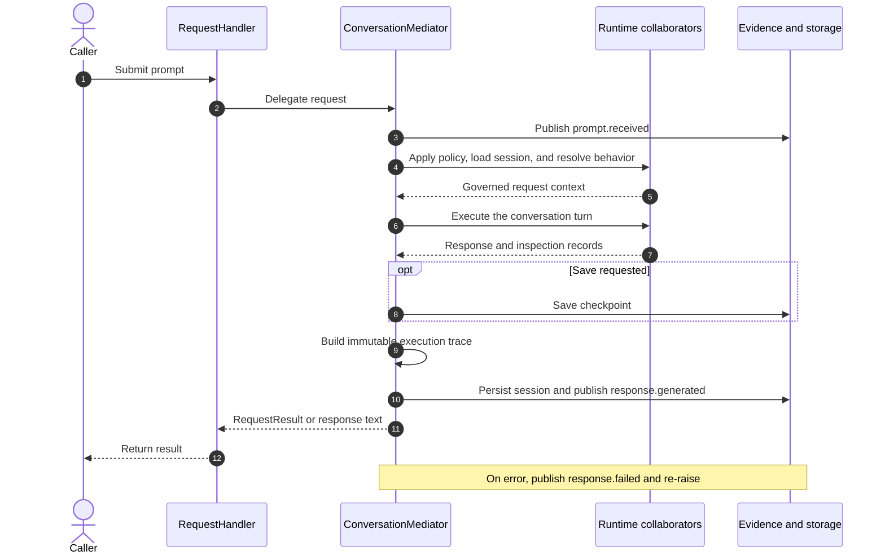

# Chapter 1 request journey

This is the compact request sequence used in Chapter 1. It introduces the
ownership boundaries without asking a first-time reader to follow every
runtime component. The diagram groups policy, session, model, and tool work as
runtime collaborators, and groups the event bus, checkpoint memory, and
session storage as evidence and storage.

## Simplified sequence

## Reading the diagram

- `RequestHandler` is the caller-facing Facade. It keeps the public entry point
  stable and delegates the lifecycle.
- `ConversationMediator` owns the sequence. It coordinates the request without
  absorbing the specialist behavior behind policy, state, model, tool, event,
  or persistence boundaries.
- Runtime collaborators represent the policy, session, behavior, model, tool,
  and conversation-engine components used during a request.
- Evidence and storage represent the event bus, checkpoint memory, and session
  persistence. These are grouped only to keep the chapter figure legible.
- A successful request creates any requested checkpoint, builds the immutable
  execution trace, persists the session, publishes the terminal success event,
  and returns a request-scoped result.

## Scope

The diagram intentionally omits the detailed `undo` path, prompt DSL parsing,
model and tool selection, response-strategy configuration, individual event
types, and the full failure branch. See the
[Chapter 2 request lifecycle](../chapter-02/request-lifecycle.md) for the
expanded sequence and [Chapter 18 full workflow](../../full_workflow.md) for
the end-to-end architecture.

## Related implementation

- [`RequestHandler`](../../../metis/handler/request_handler.py)
- [`ConversationMediator`](../../../metis/mediator/conversation_mediator.py)
- [`RequestContext`](../../../metis/mediator/context.py)
- [`RequestResult`](../../../metis/mediator/result.py)
- [`examples/run_request.py`](../../../examples/run_request.py)

## Focused verification

- [`test_conversation_mediator_lifecycle.py`](../../../tests/mediator/test_conversation_mediator_lifecycle.py)
- [`test_request_handler_response_wiring.py`](../../../tests/handler/test_request_handler_response_wiring.py)
- [`test_request_handler_events.py`](../../../tests/handler/test_request_handler_events.py)

