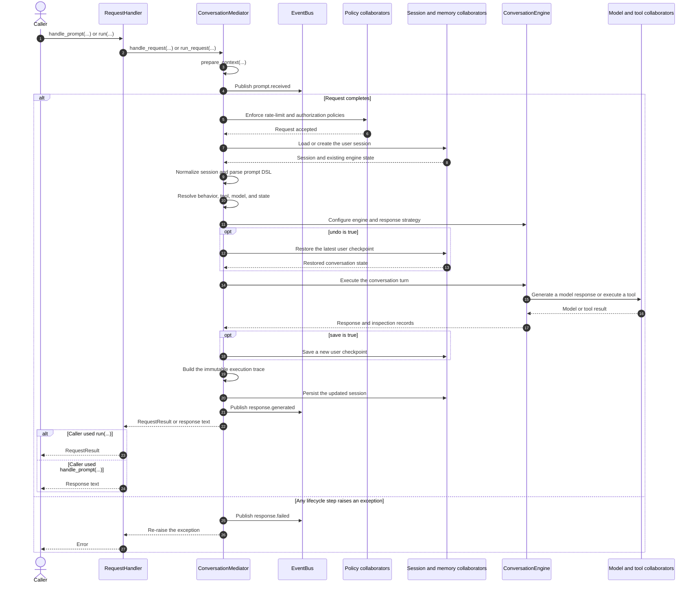

# Chapter 2 request lifecycle

This diagram expands the simplified sequence in Chapter 2. It shows the current
request path, including policy enforcement, session handling, request
configuration, execution, optional checkpoints, evidence creation, persistence,
events, and error propagation.

`RequestHandler` is the caller-facing Facade. `ConversationMediator` owns the
runtime sequence and delegates work to specialist collaborators. The `Services`
composition root assembles those collaborators before the request begins, so it
is intentionally not shown as a lifecycle owner.

## Detailed sequence



## Reading the diagram

- `RequestHandler` keeps the public request contract stable and delegates the
  lifecycle.
- `ConversationMediator` owns ordering, but not the specialist behavior behind
  policy, storage, model, tool, or engine boundaries.
- `handle_prompt(...)` preserves the compatibility contract that returns only
  response text. `run(...)` returns an immutable `RequestResult` containing the
  response and request-scoped execution evidence.
- A failure is published as `response.failed` and then re-raised. The Facade
  does not convert policy, model, or tool failures into successful responses.
- The diagram groups related collaborators to keep the sequence readable. It
  does not imply that session management and checkpoint memory are the same
  component, or that model and tool execution share an implementation.

## Related implementation

- [`RequestHandler`](../../../metis/handler/request_handler.py)
- [`ConversationMediator`](../../../metis/mediator/conversation_mediator.py)
- [`RequestContext`](../../../metis/mediator/context.py)
- [`RequestResult`](../../../metis/mediator/result.py)

## Focused verification

- [`test_chapter2_facade.py`](../../../tests/examples/test_chapter2_facade.py)
- [`test_request_handler_response_wiring.py`](../../../tests/handler/test_request_handler_response_wiring.py)
- [`test_request_handler_events.py`](../../../tests/handler/test_request_handler_events.py)

Run the provider-free example and focused tests from the repository root:

```sh
python -m metis.examples.chapter2_facade
pytest tests/examples/test_chapter2_facade.py \
  tests/handler/test_request_handler_response_wiring.py \
  tests/handler/test_request_handler_events.py
```
