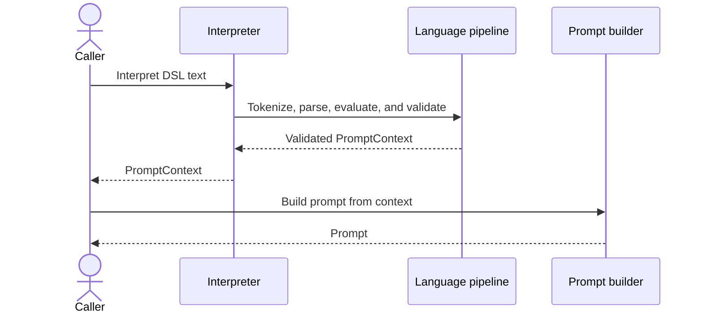

# Chapter 5 prompt DSL runtime

This is the compact sequence used for Figure 5.2 in Chapter 5. It follows one
valid prompt DSL input from the caller to a constructed prompt while keeping
the book figure readable at print width.

## Simplified sequence



## Reading the diagram

- `Interpreter` is the public DSL boundary exposed by
  `interpret_prompt_dsl(...)`.
- `Language pipeline` groups the lexer, parser, expression objects, and
  validator. At runtime, those responsibilities still run in that order; the
  grouping exists only to keep the printed figure legible.
- The interpreter returns a validated `PromptContext`. It does not construct
  the final prompt or call a model provider.
- The caller passes the validated context to `DefaultPromptBuilder`, which
  produces the deterministic prompt shown in the chapter.

## Scope

The diagram shows the successful path for one input. It intentionally omits
individual tokens, per-expression assignments, lexical and parsing error
branches, semantic-validation failures, and any later model-provider call.
Those details remain covered by the chapter's walkthrough and focused tests.

## Related implementation

- [`interpret_prompt_dsl(...)`](../../../metis/dsl/interpreter.py)
- [`lex(...)`](../../../metis/dsl/lexer.py)
- [`Parser`](../../../metis/dsl/parser.py)
- [Expression objects](../../../metis/dsl/ast.py)
- [`validate_context(...)`](../../../metis/dsl/validators.py)
- [`DefaultPromptBuilder`](../../../metis/prompts/builders/default_prompt_builder.py)

## Focused verification

- [`test_chapter5_prompt_dsl.py`](../../../tests/examples/test_chapter5_prompt_dsl.py)
- [`test_interpreter.py`](../../../tests/dsl/test_interpreter.py)
- [`test_lexer.py`](../../../tests/dsl/test_lexer.py)
- [`test_parser.py`](../../../tests/dsl/test_parser.py)

Run the provider-free example and focused tests from the repository root:

```sh
python -m metis.examples.chapter5_prompt_dsl
pytest tests/examples/test_chapter5_prompt_dsl.py \
  tests/dsl/test_interpreter.py \
  tests/dsl/test_lexer.py \
  tests/dsl/test_parser.py
```
