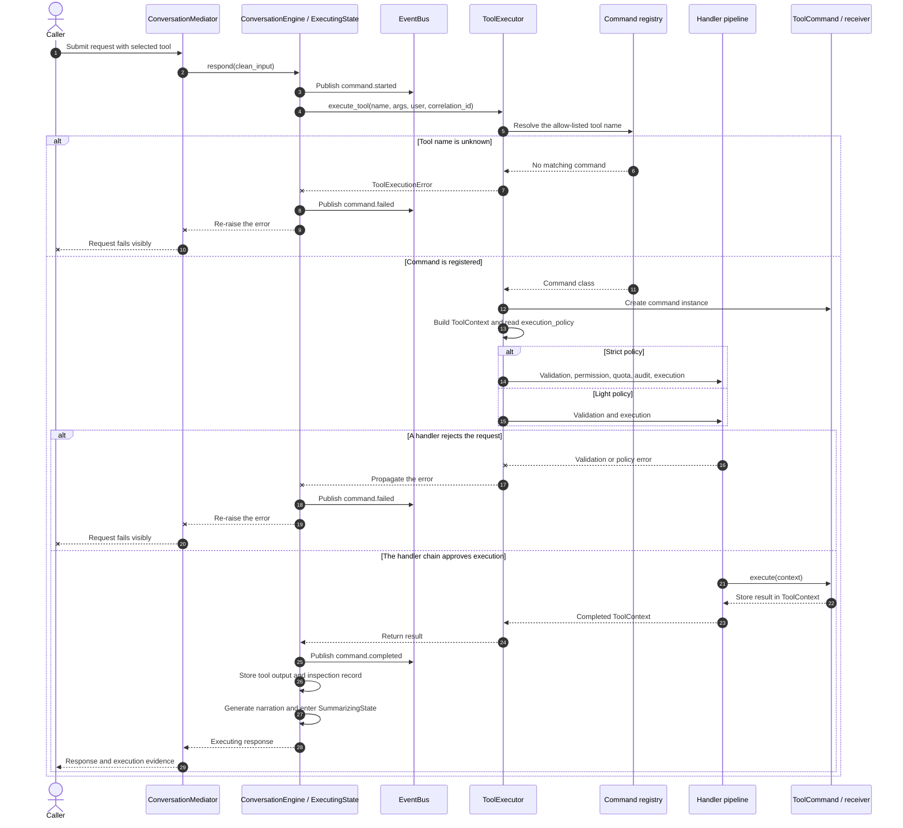

# Chapter 8 governed tool execution

This diagram expands the simplified sequence used for Figure 8.3 in Chapter 8.
It follows one selected tool from the conversation lifecycle through allow-listed
lookup, policy selection, the handler chain, command execution, lifecycle events,
and result recording.

The chapter groups several of these responsibilities so that the printed figure
remains legible. This repository version preserves the implementation detail.

## Detailed sequence



## Reading the diagram

- `ConversationMediator` coordinates the request and delegates the active turn
  to the conversation engine. It does not execute the tool itself.
- `ExecutingState` publishes lifecycle events, calls the injected
  `ToolExecutor`, records the outcome, and moves the conversation to
  `SummarizingState` after successful execution.
- `ToolExecutor` treats the proposed tool name only as an allow-listed registry
  key. It creates the command and `ToolContext`, then selects the command's
  declared `light` or `strict` execution policy.
- The light pipeline contains validation and execution. The strict pipeline
  adds permission, rate-limit, and audit handlers before execution.
- An unknown tool or any handler failure stops the sequence before the command
  can produce a side effect. The exception remains visible to the caller.
- On success, the command result returns through `ToolContext`; the state stores
  the output, publishes `command.completed`, records inspection evidence, and
  prepares narration for the next state.

## Scope

The diagram shows the runtime responsibilities relevant to Command and Chain of
Responsibility. It groups the individual handler objects under `Handler
pipeline` and combines the concrete command with its receiver. It intentionally
omits prompt rendering details, model-adapter selection, session persistence,
checkpointing, and response decoration, which are covered in other chapters.

## Related implementation

- [`ConversationMediator`](../../../metis/mediator/conversation_mediator.py)
- [`ExecutingState`](../../../metis/states/executing.py)
- [`ToolExecutor`](../../../metis/tools/tool_executor.py)
- [`ToolCommand` and `ToolContext`](../../../metis/commands/base.py)
- [Built-in command registry](../../../metis/commands/__init__.py)
- [Light and strict pipelines](../../../metis/handlers/pipelines.py)
- [Handler implementations](../../../metis/handlers)
- [`ExecuteSQLCommand`](../../../metis/commands/sql.py)
- [Provider-free Chapter 8 example](../../../metis/examples/chapter8_governed_tools.py)

## Focused verification

- [`test_chapter8_governed_tools.py`](../../../tests/examples/test_chapter8_governed_tools.py)
- [`test_tool_executor.py`](../../../tests/tools/test_tool_executor.py)
- [`test_validation_handler.py`](../../../tests/handlers/test_validation_handler.py)
- [`test_permission_handler.py`](../../../tests/handlers/test_permission_handler.py)
- [`test_ratelimit_handler.py`](../../../tests/handlers/test_ratelimit_handler.py)
- [`test_auditlog_handler.py`](../../../tests/handlers/test_auditlog_handler.py)
- [`test_execute_command_handler.py`](../../../tests/handlers/test_execute_command_handler.py)
- [`test_executing_state.py`](../../../tests/state/test_executing_state.py)
- [`test_executing_state_events.py`](../../../tests/state/test_executing_state_events.py)

Run the provider-free example and focused tests from the repository root:

```sh
python -m metis.examples.chapter8_governed_tools --city Ithaca
python -m metis.examples.chapter8_governed_tools --city Ithaca --deny
pytest tests/examples/test_chapter8_governed_tools.py \
  tests/tools/test_tool_executor.py \
  tests/handlers/test_validation_handler.py \
  tests/handlers/test_permission_handler.py \
  tests/handlers/test_ratelimit_handler.py \
  tests/handlers/test_auditlog_handler.py \
  tests/handlers/test_execute_command_handler.py \
  tests/state/test_executing_state.py \
  tests/state/test_executing_state_events.py
```
