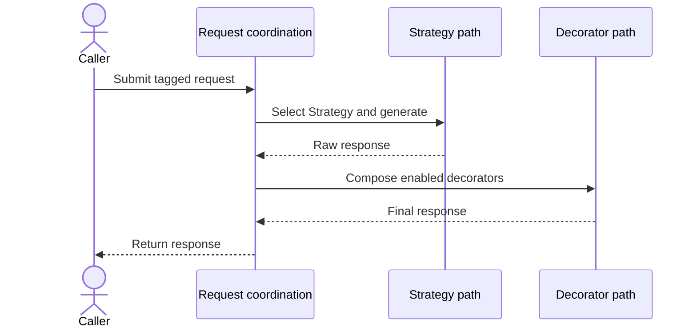
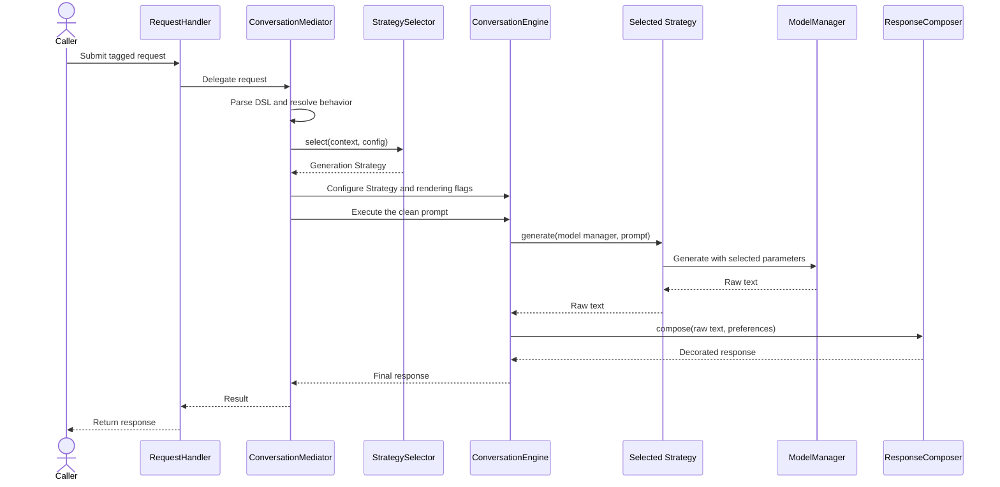

# Chapter 9 adaptive response runtime

This page contains the compact sequence used for Figure 9.3 in Chapter 9 and a
detailed component-level version for repository readers. Both show the same
ordering rule: select the generation Strategy before invoking the model, then
compose enabled Decorators only after raw text returns.

## Simplified sequence



## Detailed sequence



## Reading the diagrams

- `Request coordination` groups `RequestHandler` and `ConversationMediator`.
  The mediator parses the DSL, resolves the behavior plan, selects the
  generation Strategy, and applies rendering preferences before execution.
- `Strategy path` groups `StrategySelector`, the selected generation Strategy,
  `ConversationEngine`, and `ModelManager`. Selection completes before the
  model is invoked.
- `Decorator path` groups `ResponseComposer` and the enabled response
  decorators. Composition starts only after generation returns raw text.
- The grouped participants in the compact diagram are visual simplifications,
  not additional runtime components.
- Both diagrams preserve the architectural distinction: Strategy controls
  model-invocation posture, while Decorator controls final presentation.

## Scope

Both diagrams show the successful response path for one request. They
intentionally omit state-specific transitions, session persistence, policy
checks, events, provider-proxy details, and failure handling. Those concerns
belong to the wider request lifecycle rather than the response-adaptation
boundary illustrated here.

## Related implementation

- [`RequestHandler`](../../../metis/handler/request_handler.py)
- [`ConversationMediator`](../../../metis/mediator/conversation_mediator.py)
- [`StrategySelector`](../../../metis/response/generation/selector.py)
- [Generation Strategy contract](../../../metis/response/generation/base.py)
- [`ConversationEngine`](../../../metis/conversation_engine.py)
- [`ModelManager`](../../../metis/components/model_manager.py)
- [`ResponseComposer`](../../../metis/response/rendering/composer.py)
- [Response decorators](../../../metis/response/rendering/decorators.py)

## Focused verification

- [`test_chapter9_adaptive_responses.py`](../../../tests/examples/test_chapter9_adaptive_responses.py)
- [`test_engine_strategy_generation.py`](../../../tests/engine/test_engine_strategy_generation.py)
- [`test_engine_response_rendering_flags.py`](../../../tests/engine/test_engine_response_rendering_flags.py)

Run the provider-free example and focused tests from the repository root:

```sh
python -m metis.examples.chapter9_adaptive_responses \
  --style analytical \
  --format-markdown \
  --include-citations

pytest tests/examples/test_chapter9_adaptive_responses.py \
  tests/engine/test_engine_strategy_generation.py \
  tests/engine/test_engine_response_rendering_flags.py
```
