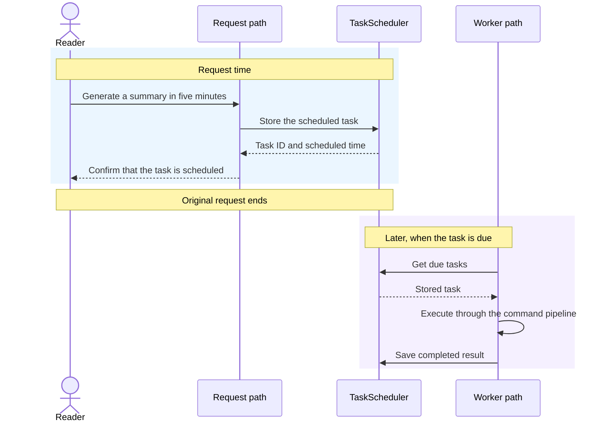
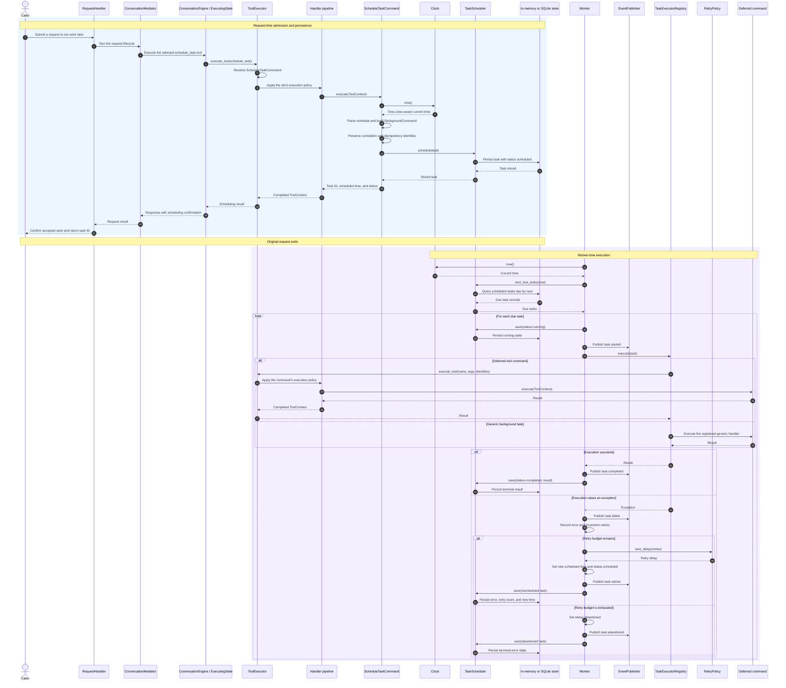

# Chapter 10 background-task lifecycle

This page contains the compact sequence used for Figure 10.3 in Chapter 10 and
a detailed component-level version for repository readers. Both diagrams show
the same lifetime boundary: the request returns after the task has been stored,
and a worker executes the stored work later through the runtime that owns it.

The compact figure groups request admission and scheduling under `Request path`
and later execution under `Worker path` so that the main time boundary remains
legible at book size. The detailed diagram expands those groups and includes
durable storage, lifecycle events, governed deferred tool execution, retry
scheduling, and abandonment.

## Simplified sequence



## Detailed sequence



## Reading the diagrams

- `Request path` groups `RequestHandler`, `ConversationMediator`,
  `ConversationEngine`, `ToolExecutor`, the strict handler pipeline, and
  `ScheduleTaskCommand`. It is a visual grouping, not an additional runtime
  class.
- `Worker path` groups `Worker`, `TaskExecutorRegistry`, `ToolExecutor`, and the
  governed command pipeline. It is also a visual grouping rather than a new
  runtime class.
- The request returns only after `TaskScheduler` has accepted the durable task.
  The returned task ID is the handle for later inspection.
- `TaskScheduler` owns persistence and eligibility. It does not execute the
  task or decide retry delays.
- `In-memory or SQLite store` represents storage owned by the concrete
  scheduler implementation. It is a visual grouping, not a separate runtime
  service.
- `Worker` owns lifecycle transitions. It stores `running` before execution,
  publishes task events, records the result or error, and persists the next
  state.
- A deferred tool command returns through the owning runtime's `ToolExecutor`,
  so the stored command crosses the same governed handler pipeline as immediate
  tool work. Stable correlation and idempotency identities cross that boundary.
- A retryable failure returns the durable task to `scheduled` with a new
  eligibility time. Exhausting the retry budget moves it to `abandoned`.

## Scope

The compact sequence focuses on the boundary between accepted work and later
execution. It intentionally hides request planning, registry lookup, policy
handlers, events, retry branches, and storage implementation details.

The detailed sequence follows the scheduling and worker responsibilities but
still groups individual policy handlers and event observers. It omits model
generation, response decoration, session persistence, distributed worker
claims, recurring schedules, and exactly-once delivery. Those concerns either
belong to other chapter diagrams or require infrastructure beyond the local
worker described in Chapter 10.

## Related implementation

- [`ScheduleTaskCommand`](../../../metis/commands/schedule.py)
- [`BackgroundCommand`, `TaskScheduler`, and scheduler implementations](../../../metis/scheduling/scheduler.py)
- [`Worker`](../../../metis/scheduling/worker.py)
- [`TaskExecutorRegistry`](../../../metis/scheduling/executors.py)
- [Retry policies](../../../metis/scheduling/retry.py)
- [Clock implementations](../../../metis/scheduling/clock.py)
- [`ToolExecutor`](../../../metis/tools/tool_executor.py)
- [Runtime assembly and deferred tool execution](../../../metis/services/services.py)
- [Provider-free Chapter 10 example](../../../metis/examples/chapter10_background_tasks.py)

## Focused verification

- [`test_schedule_task_command.py`](../../../tests/commands/test_schedule_task_command.py)
- [`test_background_scheduler.py`](../../../tests/scheduling/test_background_scheduler.py)
- [`test_sqlite_scheduler.py`](../../../tests/scheduling/test_sqlite_scheduler.py)
- [`test_scheduler_worker.py`](../../../tests/scheduling/test_scheduler_worker.py)
- [`test_worker_events.py`](../../../tests/scheduling/test_worker_events.py)
- [`test_scheduling_flow.py`](../../../tests/integration/test_scheduling_flow.py)
- [`test_full_workflow.py`](../../../tests/integration/test_full_workflow.py)
- [`test_chapter10_background_tasks.py`](../../../tests/examples/test_chapter10_background_tasks.py)

Run the provider-free example and focused tests from the repository root:

```sh
python -m metis.examples.chapter10_background_tasks --delay-minutes 5
pytest -q \
  tests/commands/test_schedule_task_command.py \
  tests/scheduling/test_background_scheduler.py \
  tests/scheduling/test_sqlite_scheduler.py \
  tests/scheduling/test_scheduler_worker.py \
  tests/scheduling/test_worker_events.py \
  tests/integration/test_scheduling_flow.py \
  tests/examples/test_chapter10_background_tasks.py
```
