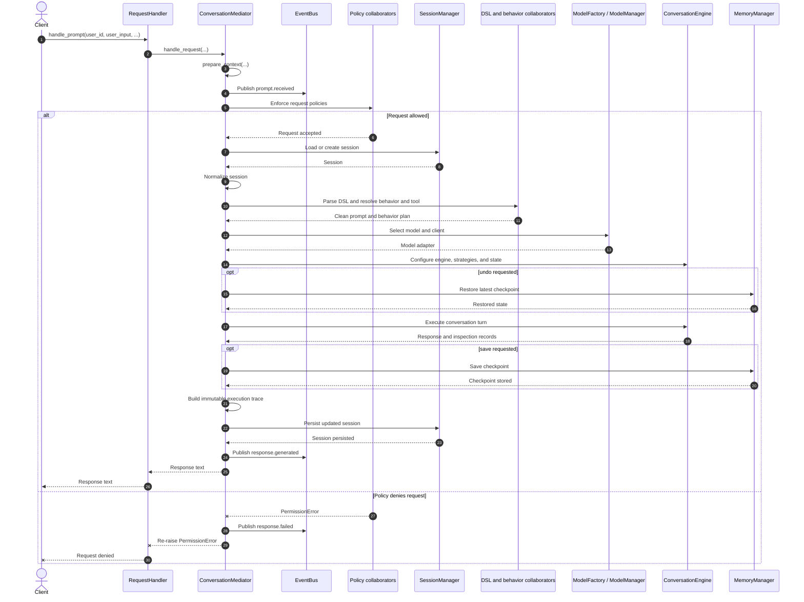

# Chapter 12 mediated request lifecycle

This diagram expands the simplified sequence used for Figure 12.3 in Chapter
12. The book figure focuses on the essential contrast: an allowed request
continues through the lifecycle, while a policy denial stops before runtime
work begins. This repository version preserves the component-level sequence.

`RequestHandler` remains the caller-facing Facade. `ConversationMediator` owns
the lifecycle order and delegates each stage to a specialist collaborator.

## Detailed sequence



## Reading the diagram

- `RequestHandler` preserves the public API and delegates the request.
- `ConversationMediator` creates one request context and owns the order of the
  lifecycle. The specialist collaborators do not call one another to advance
  the request.
- `prompt.received` is published before policy enforcement. If policy denies
  the request, the mediator publishes one `response.failed` event and
  re-raises `PermissionError`.
- A denied request does not load a session, interpret the DSL, select a model,
  execute the engine, create a checkpoint, or persist the session.
- On success, the mediator persists the updated session before publishing
  `response.generated` and returning the response through the Facade.

## Scope

The diagram separates the major lifecycle collaborators while grouping related
policy and request-planning objects. It intentionally omits the internal model
adapter flow, tool-handler chain, state transitions, observer delivery, and
composition-root construction. Those details are covered by their respective
chapter diagrams and the full-workflow documentation.

## Related implementation

- [`RequestHandler`](../../../metis/handler/request_handler.py)
- [`ConversationMediator`](../../../metis/mediator/conversation_mediator.py)
- [`RequestContext`](../../../metis/mediator/context.py)
- [`RequestResult`](../../../metis/mediator/result.py)
- [`Services`](../../../metis/services/services.py)
- [Provider-free Chapter 12 example](../../../metis/examples/chapter12_mediator_workflow.py)

## Focused verification

- [`test_request_handler.py`](../../../tests/mediator/test_request_handler.py)
- [`test_conversation_mediator_lifecycle.py`](../../../tests/mediator/test_conversation_mediator_lifecycle.py)
- [`test_services_mediator_wiring.py`](../../../tests/services/test_services_mediator_wiring.py)
- [`test_chapter12_mediator_workflow.py`](../../../tests/examples/test_chapter12_mediator_workflow.py)

Run the provider-free example and focused tests from the repository root:

```sh
python -m metis.examples.chapter12_mediator_workflow
pytest tests/mediator/test_request_handler.py \
  tests/mediator/test_conversation_mediator_lifecycle.py \
  tests/services/test_services_mediator_wiring.py \
  tests/examples/test_chapter12_mediator_workflow.py
```
