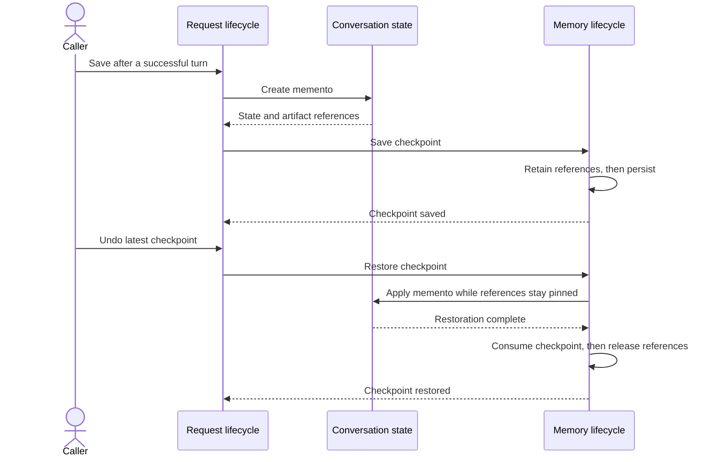
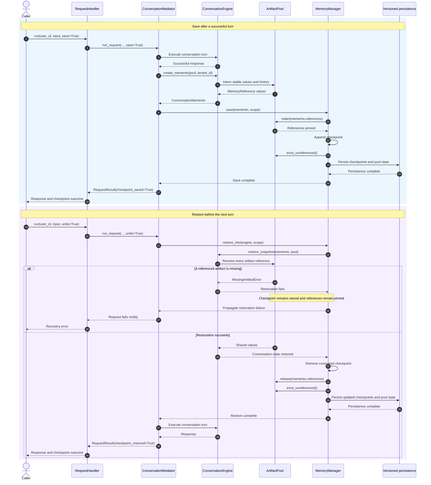

# Chapter 14 memory checkpoint lifecycle

This page contains the compact sequence used for Figure 14.2 in Chapter 14 and
a detailed component-level version for repository readers. Both diagrams show
the same artifact-liveness rule: save retains every referenced artifact before
the checkpoint is persisted, while restore releases those references only
after the conversation state has been restored successfully.

## Simplified sequence



## Detailed sequence



## Reading the diagrams

- `Request lifecycle` groups `RequestHandler` and `ConversationMediator` in the
  compact figure. The handler is the caller-facing Facade, while the mediator
  owns the request order.
- `Conversation state` represents `ConversationEngine`, which creates a
  `ConversationMemento` and applies it during restoration.
- `Memory lifecycle` groups `MemoryManager`, `ArtifactPool`, and versioned
  persistence. These are visual groupings, not additional runtime components.
- Saving occurs only after a successful turn. `MemoryManager` pins all artifact
  references before retaining and persisting the checkpoint.
- Restoration resolves and applies the memento while its references remain
  pinned. Only a successful restoration consumes the checkpoint and releases
  those references.
- If a required artifact is missing, restoration raises
  `MissingArtifactError`. The checkpoint remains available for investigation or
  a later recovery attempt.

## Scope

The compact diagram focuses on the ordering rule that makes artifact liveness
part of recovery correctness. It intentionally hides individual persistence,
eviction, session, model, service, event, and tool collaborators.

The detailed diagram expands the checkpoint boundary but still omits policy
checks, DSL interpretation, model selection, response decoration, session
persistence, and event publication. Those concerns belong to the wider request
lifecycle documented for Chapters 12 and 18.

## Related implementation

- [`RequestHandler`](../../../metis/handler/request_handler.py)
- [`ConversationMediator`](../../../metis/mediator/conversation_mediator.py)
- [`ConversationEngine`](../../../metis/conversation_engine.py)
- [`ConversationMemento`](../../../metis/memory/snapshot.py)
- [`ArtifactPool`](../../../metis/memory/pool.py)
- [`MemoryManager`](../../../metis/memory/manager.py)
- [Provider-free Chapter 14 example](../../../metis/examples/chapter14_memory.py)

## Focused verification

- [`test_artifact_pool.py`](../../../tests/memory/test_artifact_pool.py)
- [`test_lean_memento.py`](../../../tests/memory/test_lean_memento.py)
- [`test_memory_manager.py`](../../../tests/memory/test_memory_manager.py)
- [`test_full_workflow.py`](../../../tests/integration/test_full_workflow.py)

Run the provider-free example and focused tests from the repository root:

```sh
python -m metis.examples.chapter14_memory
pytest tests/memory tests/integration/test_full_workflow.py
```
