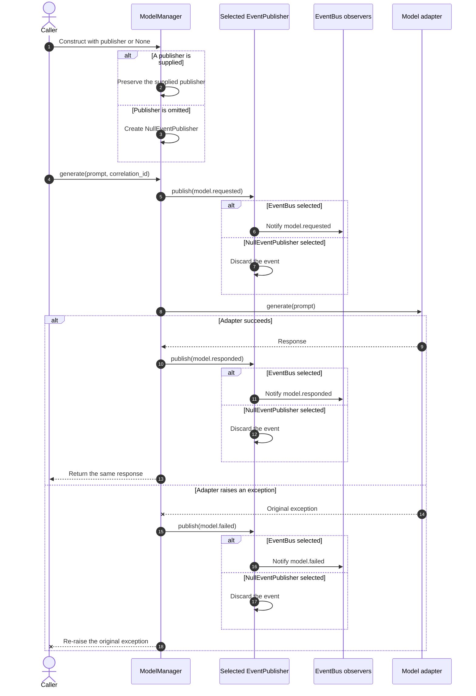

# Chapter 15 null publisher lifecycle

This diagram expands the simplified sequence used for Figure 15.2 in Chapter
15. The book figure focuses on the essential Null Object decision: publisher
choice changes event visibility without changing the model result or exception.
This repository version preserves construction-time normalization and the
complete success and failure paths.

The sequence begins at `ModelManager` because the provider-free Chapter 15
example exercises the component boundary directly. The wider public request
lifecycle is documented separately in the Chapter 12 mediator diagram.

## Detailed sequence



## Reading the diagram

- `ModelManager` uses an explicit `None` check. It preserves every supplied
  publisher, including a false-like implementation, and creates
  `NullEventPublisher` only when the argument is omitted.
- Both `EventBus` and `NullEventPublisher` satisfy the narrow `EventPublisher`
  contract. Client control flow therefore contains no publisher-presence
  branch.
- `EventBus` dispatches lifecycle events to observers.
  `NullEventPublisher` accepts and discards the same events without retaining
  state or claiming delivery.
- Publisher choice does not change the model response. It also does not
  suppress an adapter exception: `model.failed` is published or discarded,
  and the original exception is re-raised.

## Scope

The diagram shows the component boundary exercised by the Chapter 15 example.
It intentionally omits `RequestHandler`, `ConversationMediator`, session
persistence, response events, and task scheduling. Those responsibilities do
not change the Null Object behavior and are covered by the mediator, observer,
and background-task documentation.

`Worker` uses the same `EventPublisher` contract for task lifecycle events, but
its retry and terminal-state sequence is outside this model-request figure.

## Related implementation

- [`ModelManager`](../../../metis/components/model_manager.py)
- [`EventPublisher` and `NullEventPublisher`](../../../metis/events/publisher.py)
- [`EventBus`](../../../metis/events/bus.py)
- [`Worker`](../../../metis/scheduling/worker.py)
- [Provider-free Chapter 15 example](../../../metis/examples/chapter15_null_object.py)

## Focused verification

- [`test_null_event_publisher.py`](../../../tests/events/test_null_event_publisher.py)
- [`test_model_manager_events.py`](../../../tests/components/test_model_manager_events.py)

Run the provider-free configurations and focused tests from the repository
root:

```sh
python -m metis.examples.chapter15_null_object --publisher real
python -m metis.examples.chapter15_null_object --publisher null
python -m metis.examples.chapter15_null_object --publisher omitted
pytest tests/events/test_null_event_publisher.py \
  tests/components/test_model_manager_events.py -q
```
